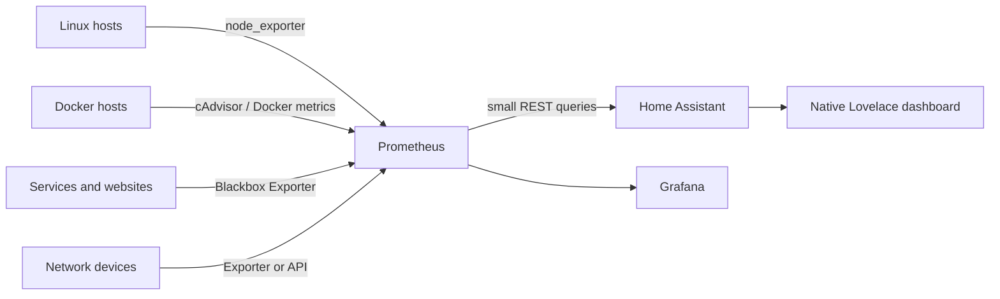

# Building a Home Assistant Homelab Dashboard

A homelab dashboard should answer a few useful questions quickly:

- Are my important services reachable?
- Is a host running out of CPU, memory or disk?
- Are my containers doing anything strange?
- Is the network itself healthy?
- Did a backup fail?

Home Assistant is a good place to present those answers because it is fast to open, works well on a wall tablet, and is already where many of us look for alerts. It is **not** the best place to store every metric from every server. Let Prometheus keep the detailed telemetry and history. Let Home Assistant show the small set of things worth acting on.

This is the pattern behind the Techdox homelab dashboard: exporters and probes collect the data, Prometheus stores it, and Home Assistant imports a curated summary for a simple control-room view.



## What you need before starting

- A working Home Assistant installation.
- A private Prometheus instance. See the [Prometheus guide](prometheus.md) if you do not have one yet.
- [Node Exporter](node-exporter.md) on each Linux host you want to track.
- A way to monitor user-facing services, such as Blackbox Exporter or Uptime Kuma.
- A basic understanding of your network names and which services are actually important.

!!! note
    Start with three hosts and five important services. A dashboard that tells you the truth is better than a huge wall of cards that nobody reads.

## Decide what belongs on the dashboard

Use Home Assistant for the things you want to see at a glance or receive a notification about:

| Area | Good dashboard signals | Better kept in Prometheus/Grafana |
|---|---|---|
| Hosts | CPU, memory, root disk, online/offline | Per-process or long-term capacity analysis |
| Containers | Container host reachable, key application healthy, unusual resource usage | Every container metric and long historical graphs |
| Services | HTTPS probe success, response time, certificate warning | Full latency distributions and request rates |
| Network | DNS resolver online, WAN/router health, active clients | Packet-level troubleshooting and flow data |
| Platforms | Proxmox guest status, Kubernetes node readiness, backup outcome | Full cluster and hypervisor diagnostics |

A container being *running* does not prove its application works. Monitor both layers:

- **Container/host health** tells you whether Docker and the underlying machine are alive.
- **Service probes** tell you whether users can actually reach the application.

A green container with a broken reverse proxy is still a broken service. Computers are very good at being technically alive while entirely useless.

## Collect the metrics

### Linux hosts with Node Exporter

Install Node Exporter on every Linux host you want to include. It exposes CPU, memory, filesystem and network-interface metrics on port `9100`.

Use predictable Prometheus job names so queries stay readable:

```yaml
scrape_configs:
  - job_name: node_exporter
    static_configs:
      - targets:
          - server-one.example.internal:9100
          - server-two.example.internal:9100
          - docker-host.example.internal:9100
```

See [Setting Up Node Exporter](node-exporter.md) for the host-side service setup.

!!! warning
    Node Exporter can reveal useful information about your hosts. Keep port `9100` on your trusted LAN or a private monitoring network. Do not publish it directly to the internet.

### Docker and container resources

For Docker hosts, add cAdvisor to expose per-container CPU, memory, filesystem and network metrics. It should only be reachable by Prometheus.

```yaml
services:
  cadvisor:
    image: gcr.io/cadvisor/cadvisor:v0.49.1
    container_name: cadvisor
    restart: unless-stopped
    privileged: true
    ports:
      - "127.0.0.1:8080:8080"
    volumes:
      - /:/rootfs:ro
      - /var/run:/var/run:ro
      - /sys:/sys:ro
      - /var/lib/docker:/var/lib/docker:ro
```

If Prometheus runs on another host, do not bind cAdvisor only to `127.0.0.1`. Instead, bind it to a private interface and firewall port `8080` so only the Prometheus host can connect.

Add it to Prometheus:

```yaml
scrape_configs:
  - job_name: cadvisor
    static_configs:
      - targets:
          - docker-host.example.internal:8080
```

!!! warning
    cAdvisor needs read access to Docker and host filesystem metadata. Keep it private and do not place it behind a public reverse proxy.

### Service health with Blackbox Exporter

Use HTTP probes for the services people actually use. This catches failures that a running container cannot: DNS, TLS, reverse proxy, login page and application startup problems.

```yaml
scrape_configs:
  - job_name: blackbox_http
    metrics_path: /probe
    params:
      module: [http_2xx]
    static_configs:
      - targets:
          - https://status.example.com
          - https://photos.example.com
          - https://requests.example.com
    relabel_configs:
      - source_labels: [__address__]
        target_label: __param_target
      - source_labels: [__param_target]
        target_label: instance
      - target_label: __address__
        replacement: blackbox-exporter.example.internal:9115
```

For internal-only services, make sure the Prometheus host resolves the same private DNS names that your users do. Do not create public DNS records just to satisfy a monitor.

### Network and platform signals

Add these once the basics are stable:

- **Pi-hole or AdGuard Home:** queries, blocked percentage, active clients and resolver status.
- **OPNsense/pfSense:** WAN state, gateway loss/latency, interface traffic and DHCP leases through a read-only exporter/API account.
- **Proxmox:** node resources, guest running state and storage usage with a read-only audit token.
- **Kubernetes:** node readiness, unavailable deployments and problem pods through kube-state-metrics.
- **Backups:** last successful backup time and whether the last attempt failed.

Use a dedicated read-only identity for any router, hypervisor or API integration. Test that it can read the data you need but cannot restart guests, change firewall rules or write configuration.

## Add a small Prometheus bridge to Home Assistant

Home Assistant can query Prometheus through its REST integration. Keep the requests small and intentional. The example below creates six simple dashboard entities, refreshed every minute.

Create a dedicated Home Assistant-to-Prometheus path on your private network, then add this to `configuration.yaml`:

```yaml
rest:
  - resource: "http://prometheus.example.internal:9090/api/v1/query"
    params:
      query: 'count(up{job=~"node_exporter|blackbox_http"})'
    scan_interval: 60
    sensor:
      - name: Homelab Prometheus Targets Total
        unique_id: homelab_prometheus_targets_total
        value_template: "{{ value_json.data.result[0].value[1] | int(0) }}"

  - resource: "http://prometheus.example.internal:9090/api/v1/query"
    params:
      query: 'sum(up{job=~"node_exporter|blackbox_http"})'
    scan_interval: 60
    sensor:
      - name: Homelab Prometheus Targets Up
        unique_id: homelab_prometheus_targets_up
        value_template: "{{ value_json.data.result[0].value[1] | int(0) }}"

  - resource: "http://prometheus.example.internal:9090/api/v1/query"
    params:
      query: 'count(probe_success{job="blackbox_http"})'
    scan_interval: 60
    sensor:
      - name: Homelab Services Total
        unique_id: homelab_services_total
        value_template: "{{ value_json.data.result[0].value[1] | int(0) }}"

  - resource: "http://prometheus.example.internal:9090/api/v1/query"
    params:
      query: 'sum(probe_success{job="blackbox_http"})'
    scan_interval: 60
    sensor:
      - name: Homelab Services Up
        unique_id: homelab_services_up
        value_template: "{{ value_json.data.result[0].value[1] | int(0) }}"

  - resource: "http://prometheus.example.internal:9090/api/v1/query"
    params:
      query: 'count(ALERTS{alertstate="firing"})'
    scan_interval: 60
    sensor:
      - name: Homelab Active Alerts
        unique_id: homelab_active_alerts
        value_template: "{{ value_json.data.result[0].value[1] | int(0) }}"

  - resource: "http://prometheus.example.internal:9090/api/v1/query"
    params:
      query: 'avg(100 - (avg by(instance) (rate(node_cpu_seconds_total{mode="idle"}[5m])) * 100))'
    scan_interval: 60
    sensor:
      - name: Homelab Average CPU
        unique_id: homelab_average_cpu
        unit_of_measurement: "%"
        value_template: "{{ value_json.data.result[0].value[1] | float(0) | round(1) }}"
```

Replace the job names with the names in your own Prometheus configuration. Test every query in the Prometheus expression browser first. If a query returns no result, Home Assistant should show `unknown`, not a reassuring but false zero.

!!! warning
    Prometheus has no built-in authentication by default. Keep it private, restrict the firewall so only trusted hosts can query it, and use a proxy or authentication layer if you need access outside your management network. Never put a long-lived API token directly in a dashboard YAML file. Store secrets in `secrets.yaml`.

### Add a status sensor

Add this below the REST configuration to turn the totals into a clear dashboard state:

```yaml
template:
  - sensor:
      - name: Homelab Health
        unique_id: homelab_health
        icon: mdi:home-analytics
        state: >
          
          
          
          
          
          
            unknown
          
            degraded
          
            healthy
          
```

This deliberately treats unavailable source data as `unknown`. A monitoring dashboard that silently turns missing data into healthy is worse than no dashboard at all.

## Validate the configuration before restarting

In Home Assistant, go to **Developer Tools → YAML**, check the configuration, then restart Home Assistant. Do not restart blindly after pasting a large configuration block.

After it comes back:

1. Open **Developer Tools → States**.
2. Confirm all six `sensor.homelab_*` REST sensors have real values.
3. Confirm `sensor.homelab_health` is `healthy`, `degraded` or `unknown` for the right reason.
4. Compare one or two values with the Prometheus expression browser.
5. If anything is missing, fix the Prometheus query before creating dashboard cards.

## Build the native Home Assistant dashboard

Create a new dashboard, then add a manual card using the built-in cards below. This is intentionally plain Home Assistant. It works without HACS and is easy to maintain when the frontend changes.

```yaml
type: vertical-stack
cards:
  - type: markdown
    content: >-
      ## Homelab control room
      {{ states('sensor.homelab_health') | capitalize }} ·
      {{ states('sensor.homelab_active_alerts') }} active alerts

  - type: glance
    title: At a glance
    state_color: true
    entities:
      - entity: sensor.homelab_health
        name: Overall health
      - entity: sensor.homelab_prometheus_targets_up
        name: Targets up
      - entity: sensor.homelab_services_up
        name: Services up
      - entity: sensor.homelab_active_alerts
        name: Alerts

  - type: entities
    title: Monitoring coverage
    entities:
      - entity: sensor.homelab_prometheus_targets_up
        name: Targets up
      - entity: sensor.homelab_prometheus_targets_total
        name: Targets total
      - entity: sensor.homelab_services_up
        name: Services up
      - entity: sensor.homelab_services_total
        name: Services total
      - entity: sensor.homelab_average_cpu
        name: Average host CPU

  - type: gauge
    entity: sensor.homelab_average_cpu
    name: Average host CPU
    min: 0
    max: 100
    severity:
      green: 0
      yellow: 70
      red: 90
```

Add further cards only when you have a clear decision they support. Useful next additions are:

- A host view with CPU, memory and disk per server.
- A service view with only the applications you would notice being down.
- A network view with DNS, WAN gateway and active client state.
- A platform view for Proxmox guests, Kubernetes nodes and backup outcome.

## Container status: what to show

Do not make the dashboard a raw list of every container. It gets noisy quickly and does not tell you what needs attention.

A practical container section usually has:

1. **Docker host online** from a Node Exporter or ICMP check.
2. **Docker daemon/container resource usage** from cAdvisor.
3. **Critical application probe status** from Blackbox Exporter or Uptime Kuma.
4. **A link to Grafana** for the detailed view when something is wrong.

For a single critical container, create a specific alert or probe. For example, probe the actual web endpoint of your password manager rather than checking whether its container name appears in Docker output.

## Keep the dashboard private

A homelab dashboard often exposes hostnames, service names, storage usage and internal topology. Treat it as an admin surface.

- Keep Home Assistant behind LAN or VPN access unless you have a deliberate remote-access design.
- Keep exporter ports and Prometheus private.
- Use read-only credentials for network devices and hypervisors.
- Avoid publishing screenshots that reveal private hostnames, IP addresses, tokens or storage paths.
- Back up Home Assistant before changing YAML or dashboards.

## How to verify it is working

You are done when all of these are true:

- Prometheus shows the intended exporter and probe targets as `UP`.
- The REST sensors in Home Assistant match the relevant Prometheus query results.
- An intentionally stopped non-critical test service changes the service count or health state as expected.
- Home Assistant shows `unknown` when Prometheus is unreachable, rather than a false healthy state.
- The dashboard renders properly on both desktop and mobile.
- Grafana still has the full history for when you need to investigate a spike or outage.

## Where to go next

Once the dashboard is stable, add notifications for real actions: a failed backup, a full disk, a service that has been down for several minutes, or a failed WAN gateway. Avoid sending a notification for every transient scrape failure. Your phone deserves better.

Useful companion guides:

- [Setting Up Prometheus with Docker Compose](prometheus.md)
- [Setting Up Node Exporter](node-exporter.md)
- [Setting Up Grafana with Docker Compose](grafana.md)
- [Setting Up cAdvisor with Docker Compose](cadvisor.md)

<a href="https://www.buymeacoffee.com/techdox"></a>

---

If there is an issue with this guide or you wish to suggest changes, please raise an issue on [GitHub](https://github.com/Techdox/techdox-docs).
