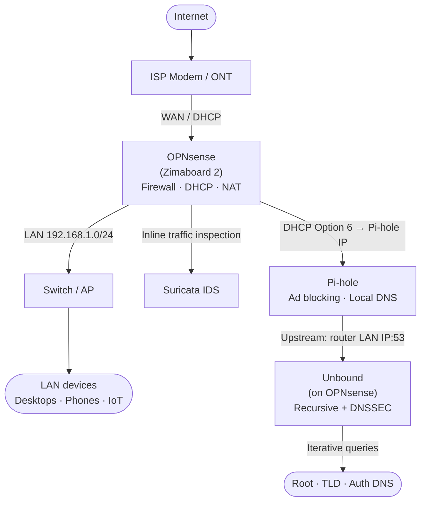
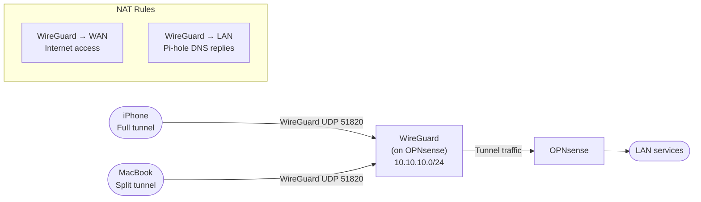
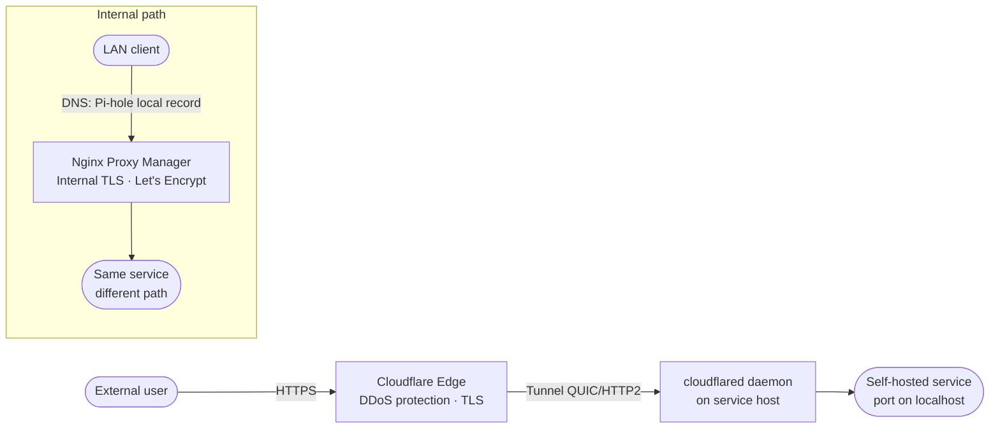
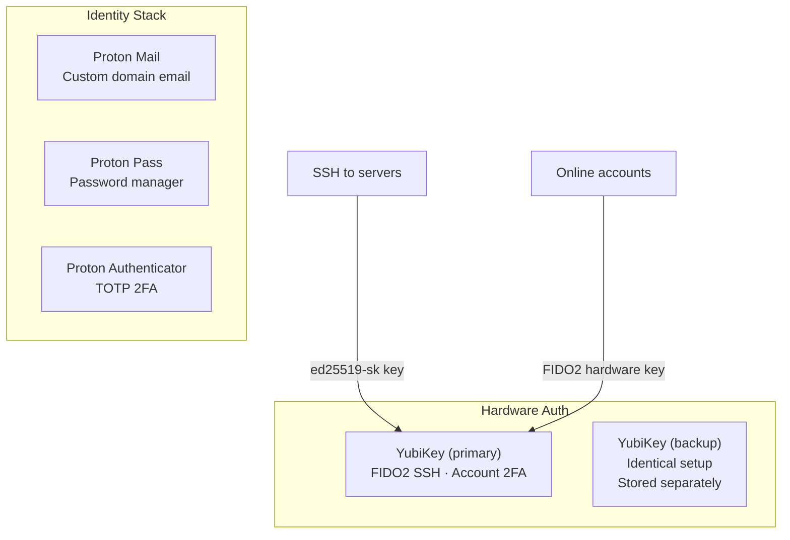
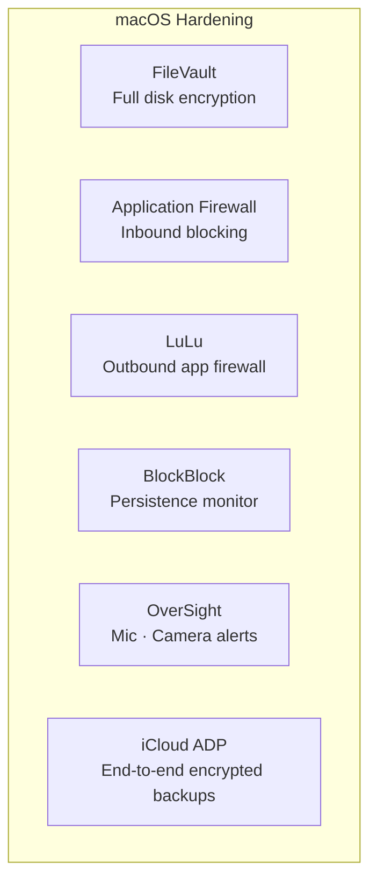

# Full Stack Architecture

This page shows the complete picture of how all the layers in the [Homelab Rebuild](index.md) connect to each other.

---

## Network & DNS Layer

---

## Remote Access Layer

---

## Public Services Layer

---

## Identity & Authentication Layer

---

## Device Security Layer

---

## Full Stack Summary

| Layer | Components | Guides |
|-------|-----------|--------|
| Network | OPNsense, Zimaboard 2, TP-Link Deco (AP mode) | [OPNsense](opnsense-zimaboard.md) |
| Intrusion Detection | Suricata IDS | [OPNsense](opnsense-zimaboard.md) |
| DNS | Pi-hole + Unbound + DNSSEC | [DNS Stack](dns-stack.md) |
| DHCP + Local DNS | Dnsmasq (on OPNsense) | [OPNsense](opnsense-zimaboard.md) |
| Remote Access | WireGuard on OPNsense | [WireGuard VPN](wireguard-vpn.md) |
| Public Services | Cloudflare Tunnels | [Cloudflare Tunnels](cloudflare-tunnels.md) |
| Internal TLS | Nginx Proxy Manager + Pi-hole local DNS | [Internal Hostnames](internal-hostnames.md) |
| Email | Proton Mail with custom domain | [Proton Mail](proton-mail-custom-domain.md) |
| Authentication | YubiKey FIDO2 SSH | [YubiKey SSH](yubikey-ssh.md) |
| Device | macOS + Objective-See tools | [macOS Hardening](macos-hardening.md) |

---

If there is an issue with this guide or you wish to suggest changes, please raise an issue on [GitHub](https://github.com/Techdox/techdox-docs).
