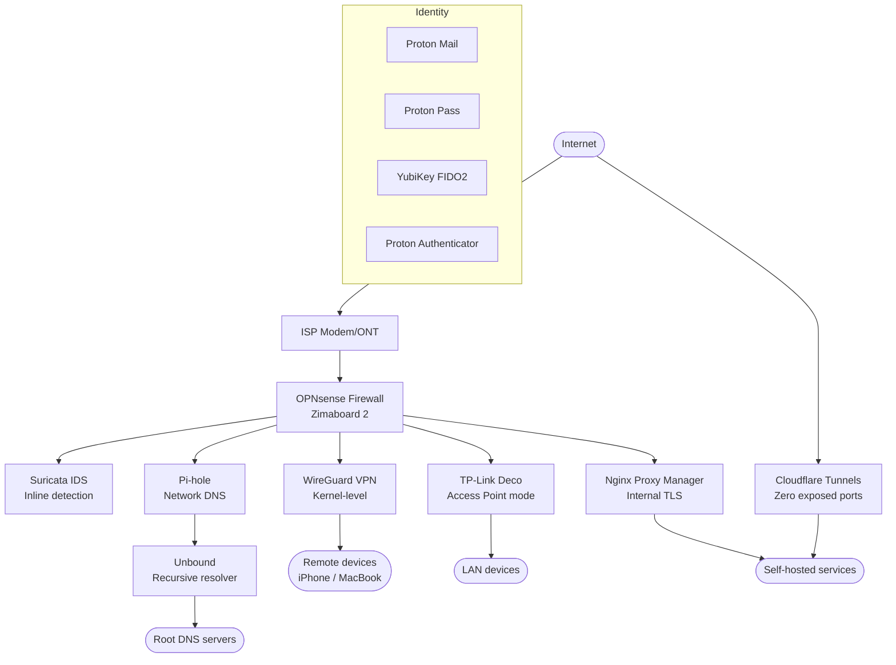

# Homelab Rebuild 2026 — Overview

This section documents a complete rebuild of a personal homelab and privacy stack from the ground up. Rather than just adding services on top of a consumer router, this rebuild takes a different approach: every layer — network, DNS, remote access, authentication, and identity — is purpose-built, open-source where possible, and designed with privacy and security as first-class requirements.

If you're running a similar setup or planning to level up from a consumer router, these guides are written from real experience, including the gotchas that most docs skip over.

## Goals

- **Open-source routing** — replace a consumer mesh router with OPNsense running on x86 hardware
- **Full DNS sovereignty** — no DNS queries leaving to Cloudflare, Google, or the ISP
- **Encrypted remote access** — WireGuard VPN built into the router, zero exposed ports
- **Public services without port forwarding** — Cloudflare Tunnels as the only inbound path
- **Hardware-bound authentication** — YubiKey FIDO2 for SSH and account security
- **Identity privacy** — Proton Mail with custom domain, no dependency on Big Tech for email

---

## Architecture Overview

---

## Component List

### Network Layer

| Component | Role |
|-----------|------|
| OPNsense on Zimaboard 2 | Router, firewall, DHCP, DNS forwarder |
| TP-Link Deco (AP mode) | Wi-Fi access points only, routing disabled |
| Suricata IDS | Inline intrusion detection |

### DNS Layer

| Component | Role |
|-----------|------|
| Pi-hole | Network-wide ad/tracker blocking, LAN DNS |
| Unbound (on OPNsense) | Recursive resolver, DNSSEC validation |
| Dnsmasq (on OPNsense) | DHCP + local hostname resolution |

### Remote Access

| Component | Role |
|-----------|------|
| WireGuard (OPNsense) | Kernel-level VPN, split or full tunnel |
| Cloudflare Tunnels | Outbound-only path for public services |

### Identity & Authentication

| Component | Role |
|-----------|------|
| Proton Mail | Privacy-first email on custom domain |
| Proton Pass | Password manager |
| Proton Authenticator | TOTP 2FA |
| YubiKey (×2) | FIDO2 SSH, account hardware keys |

### Device Security (macOS)

| Component | Role |
|-----------|------|
| FileVault | Full disk encryption |
| LuLu | Outbound application firewall |
| BlockBlock | Persistence monitor |
| OverSight | Mic/camera access alerts |

---

## Section Guide

| Page | What it covers |
|------|----------------|
| [OPNsense on Zimaboard 2](opnsense-zimaboard.md) | Hardware setup, install, initial config, DHCP, cutover |
| [Pi-hole + Unbound DNS](dns-stack.md) | Full DNS sovereignty stack, DNSSEC, ad blocking |
| [WireGuard VPN](wireguard-vpn.md) | Router-level WireGuard, split/full tunnel, firewall + NAT rules |
| [YubiKey SSH](yubikey-ssh.md) | FIDO2 SSH with ed25519-sk keys, macOS setup |
| [Cloudflare Tunnels](cloudflare-tunnels.md) | Public services with zero port exposure |
| [Internal Hostnames](internal-hostnames.md) | NPM + Pi-hole local DNS, internal TLS |
| [Proton Mail Migration](proton-mail-custom-domain.md) | Custom domain email migration, MX/SPF/DKIM/DMARC |
| [macOS Hardening](macos-hardening.md) | Native protections + Objective-See toolkit |
| [Architecture Diagram](architecture.md) | Full stack diagram with all layers |

---

---

If there is an issue with this guide or you wish to suggest changes, please raise an issue on [GitHub](https://github.com/Techdox/techdox-docs).
