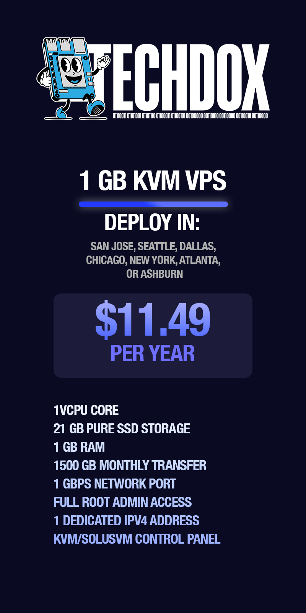
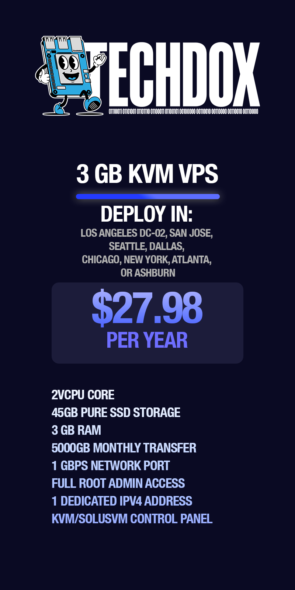

# RackNerd VPS Deals

Take advantage of these amazing VPS deals from RackNerd. Perfect for hosting small to medium-sized projects, these offers provide excellent value for your money.

## 1 GB KVM VPS

- **Deploy In:** San Jose, Seattle, Dallas, Chicago, New York, Atlanta, or Ashburn
- **Price:** $11.49 per year
- **Specifications:**
  - 1 vCPU Core
  - 21 GB Pure SSD Storage
  - 1 GB RAM
  - 1500 GB Monthly Transfer
  - 1 Gbps Network Port
  - Full Root Admin Access
  - 1 Dedicated IPv4 Address
  - KVM/SolusVM Control Panel

[Get this deal now](https://my.racknerd.com/aff.php?aff=5792&pid=826&ref=techdox.nz)

## 2 GB KVM VPS

- **Deploy In:** Los Angeles DC-02, San Jose, Seattle, Dallas, Chicago, New York, Atlanta, or Ashburn
- **Price:** $17.38 per year
- **Specifications:**
  - 1 vCPU Core
  - 35 GB Pure SSD Storage
  - 2 GB RAM
  - 2500 GB Monthly Transfer
  - 1 Gbps Network Port
  - Full Root Admin Access
  - 1 Dedicated IPv4 Address
  - KVM/SolusVM Control Panel

[Get this deal now](https://my.racknerd.com/aff.php?aff=5792&pid=827&ref=techdox.nz)

## 3 GB KVM VPS

- **Deploy In:** Los Angeles DC-02, San Jose, Seattle, Dallas, Chicago, New York, Atlanta, or Ashburn
- **Price:** $27.98 per year
- **Specifications:**
  - 2 vCPU Core
  - 45 GB Pure SSD Storage
  - 3 GB RAM
  - 5000 GB Monthly Transfer
  - 1 Gbps Network Port
  - Full Root Admin Access
  - 1 Dedicated IPv4 Address
  - KVM/SolusVM Control Panel

[Get this deal now](https://my.racknerd.com/aff.php?aff=5792&pid=828&ref=techdox.nz)

## 4 GB KVM VPS

- **Deploy In:** Los Angeles DC-02, San Jose, Seattle, Dallas, Chicago, New York, Atlanta, or Ashburn
- **Price:** $37.38 per year
- **Specifications:**
  - 2 vCPU Core
  - 60 GB Pure SSD Storage
  - 4 GB RAM
  - 8000 GB Monthly Transfer
  - 1 Gbps Network Port
  - Full Root Admin Access
  - 1 Dedicated IPv4 Address
  - KVM/SolusVM Control Panel

[Get this deal now](https://my.racknerd.com/aff.php?aff=5792&pid=829&ref=techdox.nz)

---

**Note:** All prices and specifications are subject to change. Please verify the details on RackNerd's website before making a purchase.
