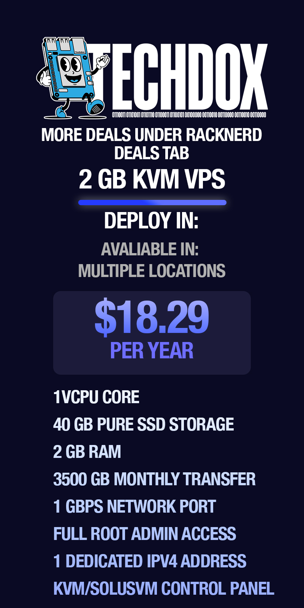
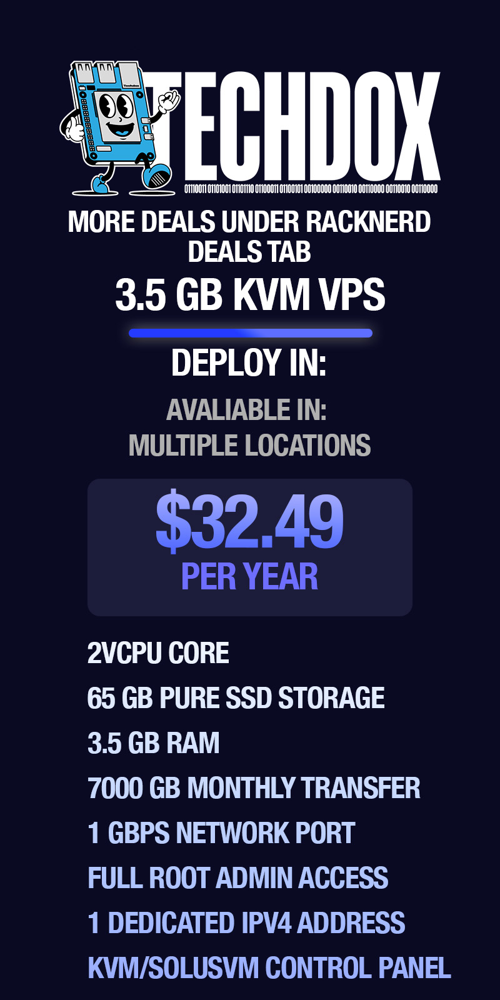
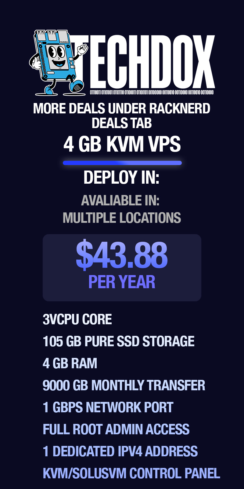
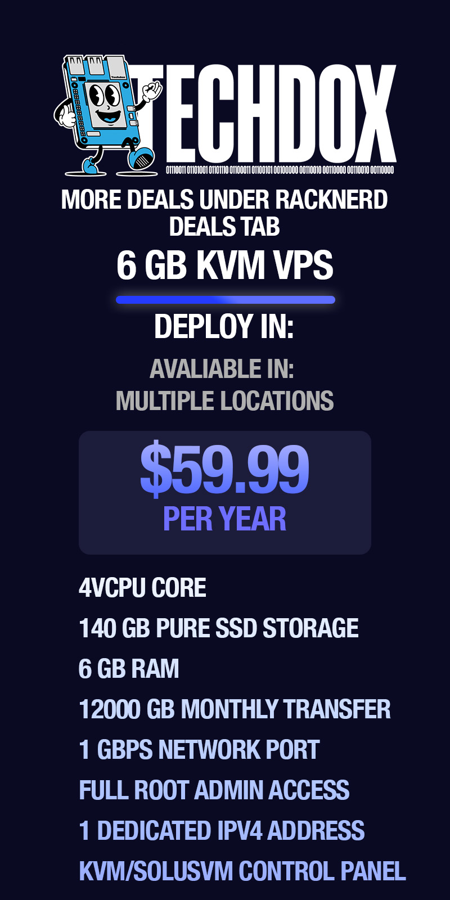

# RackNerd VPS Deals

Take advantage of these amazing VPS deals from RackNerd. Perfect for hosting small to medium-sized projects, these offers provide excellent value for your money.

## 1 GB KVM VPS

- **Deploy In:** Multiple Locations
- **Price:** $11.29 per year
- **Specifications:**
  - 1 vCPU Core
  - 24 GB Pure SSD Storage
  - 1 GB RAM
  - 1500 GB Monthly Transfer
  - 1 Gbps Network Port
  - Full Root Admin Access
  - 1 Dedicated IPv4 Address
  - KVM/SolusVM Control Panel

[Get this deal now](https://my.racknerd.com/aff.php?aff=5792&pid=903&ref=techdox.nz)

## 2 GB KVM VPS

- **Deploy In:** Multiple Locations
- **Price:** $18.29 per year
- **Specifications:**
  - 1 vCPU Core
  - 40 GB Pure SSD Storage
  - 2 GB RAM
  - 3500 GB Monthly Transfer
  - 1 Gbps Network Port
  - Full Root Admin Access
  - 1 Dedicated IPv4 Address
  - KVM/SolusVM Control Panel

[Get this deal now](https://my.racknerd.com/aff.php?aff=5792&pid=904&ref=techdox.nz)

## 3.5 GB KVM VPS

- **Deploy In:** Multiple Locations
- **Price:** $32.49 per year
- **Specifications:**
  - 2 vCPU Core
  - 65 GB Pure SSD Storage
  - 3.5 GB RAM
  - 7000 GB Monthly Transfer
  - 1 Gbps Network Port
  - Full Root Admin Access
  - 1 Dedicated IPv4 Address
  - KVM/SolusVM Control Panel

[Get this deal now](https://my.racknerd.com/aff.php?aff=5792&pid=905&ref=techdox.nz)

## 4 GB KVM VPS

- **Deploy In:** Multiple Locations
- **Price:** $43.88 per year
- **Specifications:**
  - 3 vCPU Core
  - 105 GB Pure SSD Storage
  - 4 GB RAM
  - 9000 GB Monthly Transfer
  - 1 Gbps Network Port
  - Full Root Admin Access
  - 1 Dedicated IPv4 Address
  - KVM/SolusVM Control Panel

[Get this deal now](https://my.racknerd.com/aff.php?aff=5792&pid=906&ref=techdox.nz)

## 6 GB KVM VPS

- **Deploy In:** Multiple Locations
- **Price:** $59.99 per year
- **Specifications:**
  - 4 vCPU Core
  - 140 GB Pure SSD Storage
  - 6 GB RAM
  - 12000 GB Monthly Transfer
  - 1 Gbps Network Port
  - Full Root Admin Access
  - 1 Dedicated IPv4 Address
  - KVM/SolusVM Control Panel

[Get this deal now](https://my.racknerd.com/aff.php?aff=5792&pid=907&ref=techdox.nz)

---

**Note:** All prices and specifications are subject to change. Please verify the details on RackNerd's website before making a purchase.

---

If there is an issue with this guide or you wish to suggest changes, please raise an issue on [GitHub](https://github.com/Techdox/techdox-docs).
