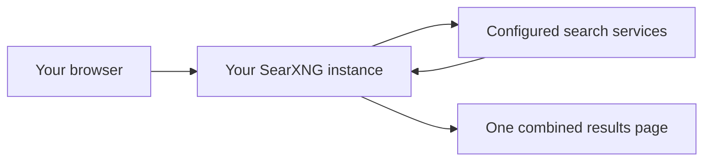

# Deploying SearXNG with Docker Compose

## Introduction to SearXNG

[SearXNG](https://github.com/searxng/searxng) is a free, open-source metasearch engine. It sends your query to multiple configured search services, combines their responses, and presents the results through one interface you control.



SearXNG does not build a personalised search profile or forward your browser cookies to upstream search services. Those services see the IP address of the SearXNG server instead of the device making the request.

!!! warning "Privacy is not anonymity"
    If you host SearXNG at home, the instance may still use your home public IP address. If you host it on a VPS, the search services see the VPS address, but the hosting provider becomes another party you need to trust. The administrator of any SearXNG instance also controls its configuration and logs.

## Prerequisites

Before starting, ensure the host has:

- Docker Engine
- Docker Compose v2
- `curl`
- A user with permission to run Docker

Check Docker and Compose:

```bash
docker --version
docker compose version
```

## Deploying SearXNG

The SearXNG project recommends using its official Compose template for container deployments. This template runs SearXNG with Valkey and creates persistent configuration and cache storage.

### 1. Create the Project Directory

```bash
mkdir -p ./searxng/core-config
cd ./searxng
```

### 2. Download the Official Compose Files

```bash
curl -fsSL \
  -O https://raw.githubusercontent.com/searxng/searxng/master/container/docker-compose.yml \
  -O https://raw.githubusercontent.com/searxng/searxng/master/container/.env.example

cp .env.example .env
```

!!! note "Use the current template"
    The old `searxng-docker` repository has been superseded. New installations should use the template from the main `searxng/searxng` repository shown above.

### 3. Configure the Local Port

Open the environment file:

```bash
nano .env
```

Add or uncomment:

```dotenv
SEARXNG_VERSION=latest
SEARXNG_HOST=127.0.0.1
SEARXNG_PORT=8080
```

Binding to `127.0.0.1` prevents other devices from connecting directly to the port. This is the safest default for a local installation or a reverse proxy running directly on the host.

!!! tip "Trusted LAN access"
    To access SearXNG directly from your LAN, replace `127.0.0.1` with the Docker host's LAN address, such as `192.168.1.50`. Do not bind the port to a public interface unless it is protected by a firewall and an appropriately configured reverse proxy.

### 4. Start the Services

```bash
docker compose up -d
docker compose ps
```

Both `searxng-core` and `searxng-valkey` should report a running status.

Open the web interface:

```text
http://127.0.0.1:8080
```

If you used the host's LAN address, open `http://<host-lan-ip>:8080` from another device on the same network.

## Customising the Instance

After the first start, SearXNG creates its persistent configuration in:

```text
core-config/settings.yml
```

Open it with:

```bash
nano core-config/settings.yml
```

You can update existing sections with settings such as:

```yaml
general:
  instance_name: "My Search"

ui:
  theme_args:
    simple_style: dark
```

!!! warning "Preserve the generated secret"
    Merge changes into the existing file instead of replacing it. Keep the generated `secret_key`, retain `use_default_settings`, and avoid creating duplicate YAML keys.

Restart the core service after making changes:

```bash
docker compose restart core
```

## Searching with SearXNG

Normal searches use the engines enabled for the selected category. SearXNG also supports shortcuts that target a specific engine or category:

```text
!gh searxng
!wp metasearch engine
!images aurora
:fr !wp Nouvelle-Zélande
```

- `!gh` searches GitHub.
- `!wp` searches Wikipedia.
- `!images` searches the image category.
- `:fr` selects French for the query.

Open **Preferences** in the SearXNG interface to choose engines, categories, language, safe-search behaviour, and theme options.

!!! warning "External bangs leave SearXNG"
    Shortcuts beginning with `!!` redirect the browser to an external service. Once redirected, SearXNG can no longer protect that request.

## Remote Access

For private remote access, a VPN is generally simpler and safer than publishing the instance directly. See the [WireGuard](wireguard.md) and [WG-Easy](wgeasy.md) guides.

If you publish SearXNG through a domain:

1. Put it behind an HTTPS reverse proxy such as [Nginx Proxy Manager](npm.md) or [Traefik](traefik.md).
2. Restrict the direct container port with the host firewall.
3. Configure SearXNG's limiter and trusted proxy headers correctly.
4. Add authentication unless the instance is intentionally public.
5. Review the official [public instance documentation](https://docs.searxng.org/admin/searx.limiter.html) before exposing it.

## Updating SearXNG

Update the container images:

```bash
cd ./searxng
docker compose pull
docker compose up -d
docker compose ps
```

The project changes quickly. Review the official migration notes and current Compose template before major updates.

To refresh the template files:

```bash
docker compose down

curl -fsSLO \
  https://raw.githubusercontent.com/searxng/searxng/master/container/docker-compose.yml \
  https://raw.githubusercontent.com/searxng/searxng/master/container/.env.example

docker compose up -d
```

Your customised `.env` file and `core-config` directory are not replaced by these commands.

## Backing Up the Configuration

The most important local data is the configuration directory and environment file:

```bash
tar -czf searxng-config-backup.tar.gz .env core-config
```

Store the backup securely because it contains your instance configuration and secret key.

## Troubleshooting

Check service status and recent logs:

```bash
docker compose ps
docker compose logs --tail=100 core
docker compose logs --tail=100 valkey
```

### An Engine Returns No Results

Upstream search services can rate-limit or block the instance IP. A CAPTCHA or engine timeout does not necessarily mean the SearXNG container is unhealthy. Try another enabled engine and review the core logs.

### The Web Interface Does Not Load

Confirm that:

- Both containers are running.
- The URL uses the host and port configured in `.env`.
- A host firewall is not blocking LAN access.
- `core-config/settings.yml` contains valid YAML.

## Official Resources

- [SearXNG documentation](https://docs.searxng.org/)
- [Official container installation](https://docs.searxng.org/admin/installation-docker.html)
- [Search syntax](https://docs.searxng.org/user/search-syntax.html)
- [Why use a private instance?](https://docs.searxng.org/own-instance.html)
- [Public instance directory](https://searx.space/)

<a href="https://www.buymeacoffee.com/techdox"></a>

---

If there is an issue with this guide or you wish to suggest changes, please raise an issue on [GitHub](https://github.com/Techdox/techdox-docs).
